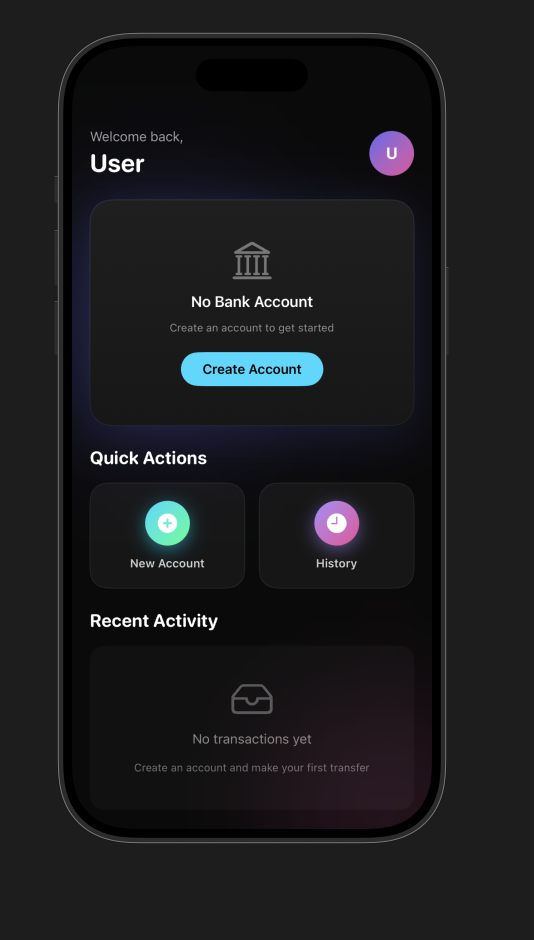

Payment System Application

A simple backend payment system application that demonstrates the core routing and functionality of basic payment platforms such as Venmo and Cash App. This project is primarily built for practice and learning purposes, but its structure allows for further expansion into a more robust system.

This frontend is mainly developed on Swift for cross-platforms like MacOS, iOS and iPad. 

A few things to remember about this application:

    1 - Program is built on XCode 22
    2 - The program is built for devices above version 18

Please remember, there is a backend for this software with a few basic functionalities built on different tech stacks. Please checkout below link for the backend:

    https://github.com/TamimDostyar/PaymentSystem

Here’s an image showing the interior view:

Contributions

Improvements are welcome! Feel free to clone the repository, make your changes, and submit a pull request.

License

MIT License
